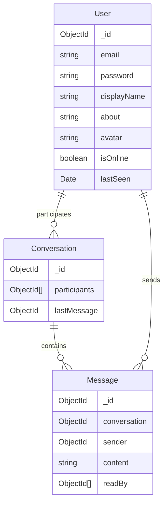

# Connect — Real-time Messaging App

A full-stack, WhatsApp-style messaging application built with **Next.js 14**, **MongoDB**, **Socket.io**, and **Tailwind CSS**.


## Features

- 🔐 **JWT Authentication** — Secure login/register with hashed passwords
- 💬 **Real-time Messaging** — Instant delivery via Socket.io WebSockets
- ⌨️ **Typing Indicators** — "User is typing..." with animated dots
- 🟢 **Online/Last Seen** — Live presence status for all users
- ✅ **Read Receipts** — Single/double check marks on messages
- 🔍 **User Discovery** — Search all registered users to start chats
- 📜 **Message Persistence** — Full chat history saved in MongoDB
- 📱 **Mobile Responsive** — Sidebar collapses on mobile with back navigation
- 🛡️ **XSS Protection** — Messages sanitized via DOMPurify
- 📄 **Pagination** — Infinite scroll for older messages

## Tech Stack

| Layer | Technology |
|-------|-----------|
| Frontend | Next.js 14, React 19, TypeScript, Tailwind CSS v4 |
| Backend | Next.js API Routes + Custom Node.js Server |
| Database | MongoDB (Mongoose ODM) |
| Real-time | Socket.io |
| Auth | JWT (jsonwebtoken + bcryptjs) |

## Getting Started

### Prerequisites

- Node.js 20+
- MongoDB (Atlas or local instance)

### Installation

```bash
git clone <your-repo-url>
cd Connect
npm install
```

### Environment Setup

Create a `.env.local` file:

```env
MONGODB_URI=mongodb+srv://<user>:<pass>@cluster.mongodb.net/connect
JWT_SECRET=your-secret-key
NEXT_PUBLIC_APP_URL=http://localhost:3000
```

### Seed Test Users

```bash
npm run seed
```

This creates two test accounts:
| Email | Password |
|-------|----------|
| alice@connect.app | password123 |
| bob@connect.app | password123 |

### Run Development Server

```bash
npm run dev
```

Open [http://localhost:3000](http://localhost:3000) in your browser.

## Testing Real-time Chat

1. Open `http://localhost:3000` in one browser (or regular window)
2. Login as **alice@connect.app**
3. Open `http://localhost:3000` in another browser (or incognito)
4. Login as **bob@connect.app**
5. Search for the other user and start chatting!

## Project Structure

```
src/
├── app/
│   ├── api/
│   │   ├── auth/         # Login, Register, Me routes
│   │   ├── conversations/ # Create & list conversations
│   │   ├── messages/      # Send, fetch, mark read
│   │   ├── users/         # Search & profile update
│   │   └── socketio/      # Socket.io server init
│   ├── chat/             # Main chat page
│   ├── login/            # Login page
│   └── register/         # Register page
├── components/
│   ├── ChatWindow.tsx    # Message list + input
│   ├── MessageBubble.tsx # Individual message
│   ├── ProfileModal.tsx  # Edit profile
│   ├── Sidebar.tsx       # Conversation list
│   └── UserSearchModal.tsx # Find new users
├── context/
│   └── AuthContext.tsx   # Auth state management
├── hooks/
│   └── useSocket.ts      # Socket.io client hook
├── lib/
│   ├── auth.ts           # JWT utilities
│   └── mongodb.ts        # DB connection
└── models/
    ├── User.ts
    ├── Conversation.ts
    └── Message.ts
```

## Database Schema



## License

MIT
